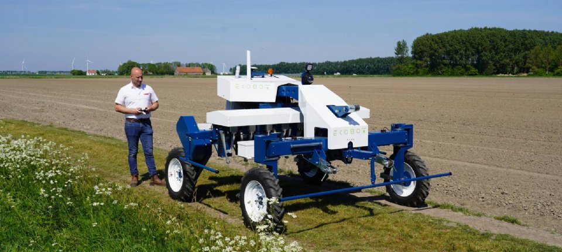
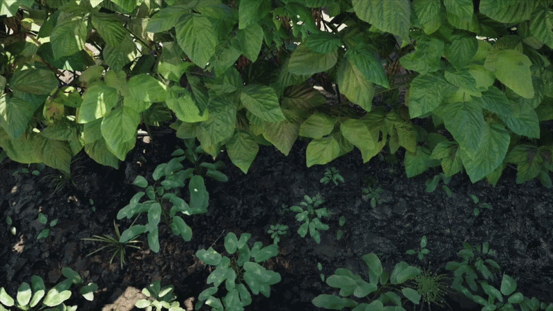
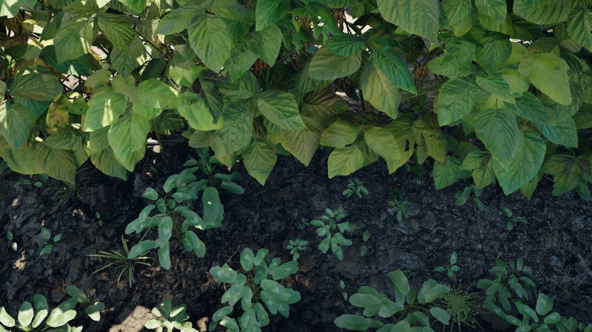
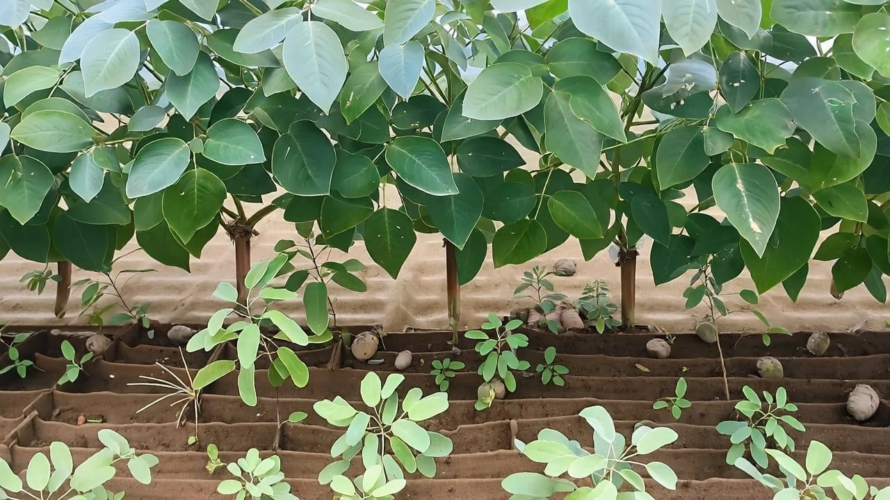
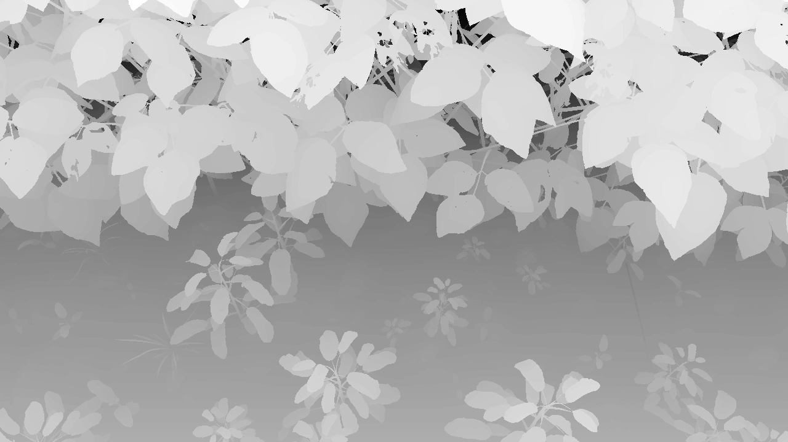
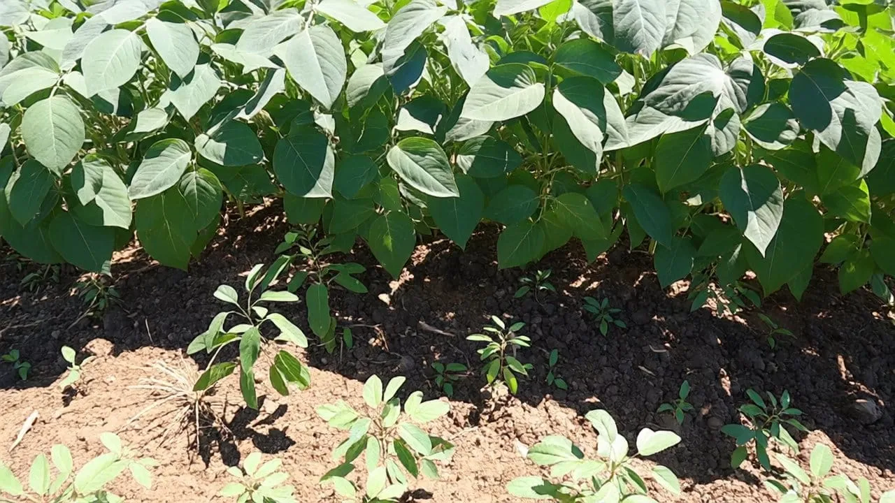
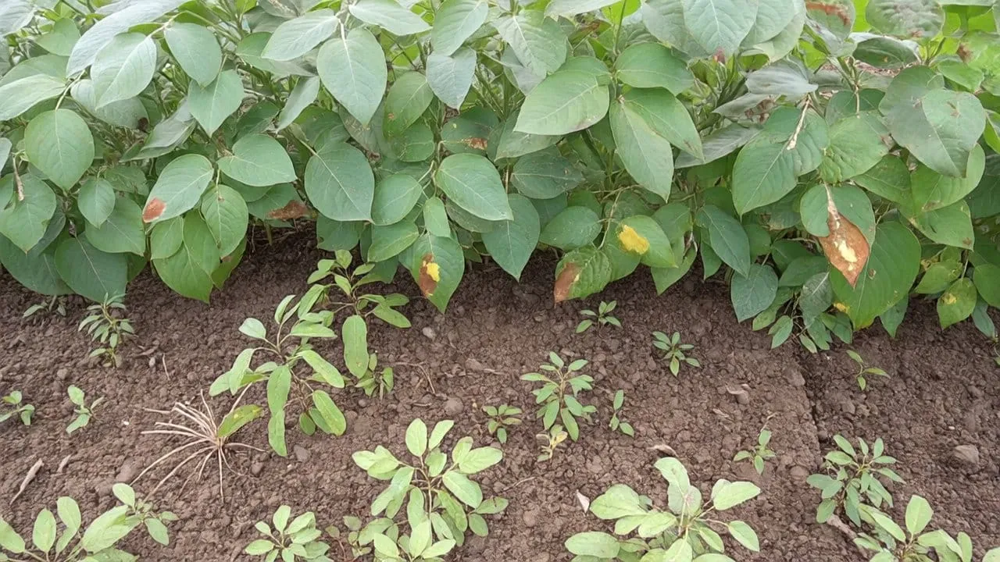
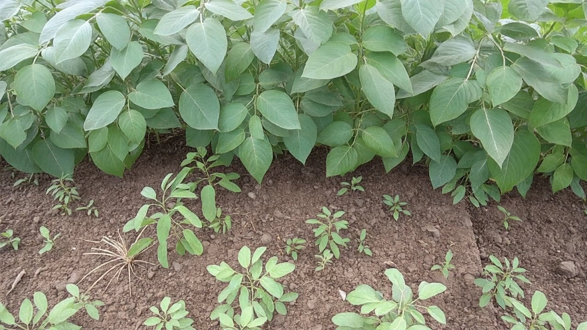
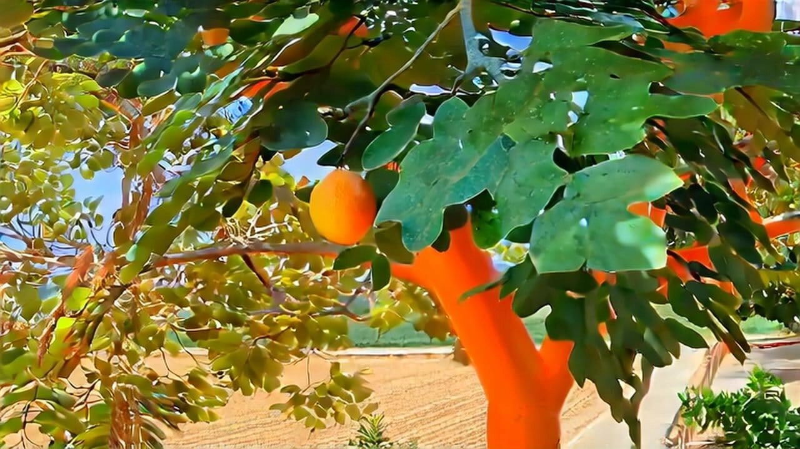
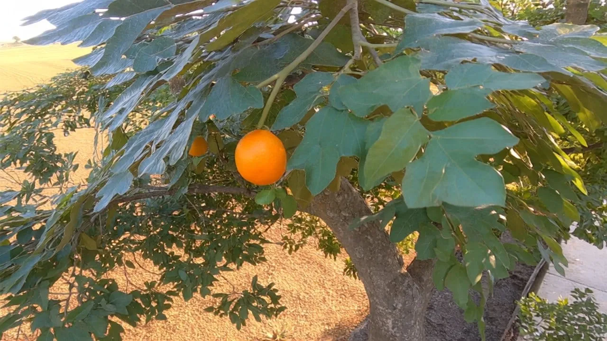

Why we're building this
=======================

<!-- column_layout: [1, 1] -->
<!-- column: 0 -->



<!-- column: 1 -->

* Port the ROS 1 software while field work continues.
* Test weed removal when the robot or a suitable crop row is unavailable.
* Compare tool designs without fabricating every candidate first.
* Generate labelled images for perception experiments.

<!-- reset_layout -->

The output should be a test we can rerun after a tool change. Photorealism matters when we test the cameras, not when we test a joint limit.

<!-- speaker_note: EKOBOT began in Sweden and the business was sold to the Dutch company HH Agriculture Investments in 2024. The machine in this photo is the current context for the discussion: an electric carrier, cameras, plant detection, and a weeding tool that has to move at exactly the right time. We are looking for work that can move indoors without pretending that a simulator can approve a field machine. Photo: Nieuwe Oogst, 14 May 2025. -->

<!-- end_slide -->

What we're simulating
=====================

```faqe:graph
title = "One field operation, several coupled systems"
columns = 4
rows = 2
[[nodes]]
id = "crop"
title = "crop row"
subtitle = "plants · weeds · soil"
column = 1
row = 1
tone = "positive"
[[nodes]]
id = "sense"
title = "camera system"
subtitle = "3D view · localisation"
column = 2
row = 1
tone = "accent"
[[nodes]]
id = "decide"
title = "perception"
subtitle = "plant class · position"
column = 3
row = 1
[[nodes]]
id = "tool"
title = "weeding tool"
subtitle = "timing · path · force"
column = 4
row = 1
tone = "warning"
[[nodes]]
id = "carrier"
title = "electric carrier"
subtitle = "navigation · safety"
column = 2
row = 2
[[nodes]]
id = "record"
title = "field record"
subtitle = "events · outcomes"
column = 3
row = 2
[[edges]]
from = "crop"
to = "sense"
[[edges]]
from = "sense"
to = "decide"
[[edges]]
from = "decide"
to = "tool"
[[edges]]
from = "carrier"
to = "sense"
[[edges]]
from = "tool"
to = "record"
[[edges]]
from = "carrier"
to = "record"
```

The blade can still hit the wrong plant after a correct detection. Vehicle motion and timestamps are part of the tool accuracy.

<!-- speaker_note: EKOBOT describes the carrier, the mechanical tool, and the camera and AI system as separate subsystems. In a test setup we also need the state of the field and a record of what the tool touched. That is how we can tell whether a miss began in detection, localisation, vehicle motion, or the tool itself. -->

<!-- end_slide -->

What counts as a useful result?
===============================

```faqe:table
variant = "comparison"
columns = ["Question", "Measure", "Final evidence"]
[[rows]]
cells = ["Did we remove the weed?", "removal rate by class", "labelled field plot"]
[[rows]]
cells = ["Did we protect the crop?", "crop contacts and damage", "post-pass inspection"]
[[rows]]
cells = ["Did the tool track its target?", "tip error and timing", "high-speed video"]
[[rows]]
cells = ["Can the system keep working?", "misses, stops, recovery", "full-row run"]
```

The simulator gives us repeatable runs and a very detailed log. The field tells us whether any of it was accurate.

<!-- speaker_note: We should settle these measurements before anyone spends weeks modelling a field. Otherwise it is easy to build a convincing scene that cannot answer the question we care about. Weed removal and crop damage need separate scores. A robot that removes every weed by clipping the onions has not passed. -->

<!-- end_slide -->

Where ROS 2 fits
================

* The simulated camera publishes the same messages as the real camera.
* Simulator adapters stop at the hardware boundary.
* We record commands, sensor data, transforms, and outcomes in rosbag2.
* Product nodes use the same launch files and parameters where that makes sense.
* A run records its scene, robot asset, calibration, software revision, and seed.

The perception and control nodes should use the same ROS interfaces in simulation and on the robot.

<!-- speaker_note: During the ROS 2 port we get to choose these boundaries once. The camera driver, motor driver, and tool driver have simulated counterparts. Everything above those drivers should be ordinary robot software. This keeps simulation work out of the deployed nodes and makes recorded data much easier to replay. -->

<!-- end_slide -->

How the loop runs
=================

```faqe:graph
title = "ROS 2 software in the loop"
columns = 4
rows = 2
[[nodes]]
id = "world"
title = "Isaac Sim"
subtitle = "USD · PhysX · sensors"
column = 1
row = 1
tone = "accent"
[[nodes]]
id = "bridge"
title = "ROS 2 bridge"
subtitle = "topics · services · clock"
column = 2
row = 1
[[nodes]]
id = "stack"
title = "robot stack"
subtitle = "perception · control"
column = 3
row = 1
[[nodes]]
id = "act"
title = "actuator commands"
subtitle = "carrier · tool"
column = 4
row = 1
tone = "warning"
[[nodes]]
id = "bag"
title = "rosbag2"
subtitle = "replay · comparison"
column = 2
row = 2
[[nodes]]
id = "score"
title = "evaluator"
subtitle = "events · metrics"
column = 4
row = 2
tone = "positive"
[[edges]]
from = "world"
to = "bridge"
[[edges]]
from = "bridge"
to = "stack"
[[edges]]
from = "stack"
to = "act"
[[edges]]
from = "act"
to = "world"
[[edges]]
from = "bridge"
to = "bag"
[[edges]]
from = "world"
to = "score"
[[edges]]
from = "act"
to = "score"
```

<!-- speaker_note: Isaac Sim talks to ROS 2 through its bridge. While the simulation is playing, it publishes sensor data and clock messages and receives commands. The evaluator gets a second feed with exact simulator state. Product code never sees that feed; it would be cheating. -->

<!-- end_slide -->

The boring stuff that breaks a run
=================================

```faqe:grid
columns = 2
variant = "cards"
[[items]]
eyebrow = "time"
title = "Use simulated clock"
bullets = ["publish /clock", "set use_sim_time", "timestamp every observation", "test resets and pauses"]
tone = "accent"
[[items]]
eyebrow = "delivery"
title = "Match the real interfaces"
bullets = ["sensor-data QoS", "bounded queues", "late subscriber behaviour", "intentional loss tests"]
tone = "warning"
[[items]]
eyebrow = "replay"
title = "Capture the run"
bullets = ["scene revision", "random seed", "parameter files", "software commit"]
tone = "positive"
[[items]]
eyebrow = "speed"
title = "Measure RTF"
bullets = ["physics rate", "render rate", "ROS callback load", "GPU saturation"]
```

Real-time factor tells us how much simulated time passed for each second on the wall clock.

<!-- speaker_note: A seed is not enough. We also need the scene and asset revisions, parameters, calibration, software commit, physics step, and render settings. Use the same sensor QoS as the robot. A node that passes because simulated packets never arrive late is giving us a false sense of safety. Speed is a separate number: a slow test can still be correct. -->

<!-- end_slide -->

How far from the field?
=======================

```faqe:timeline
[[items]]
title = "node tests"
body = "messages · transforms · algorithms"
[[items]]
title = "headless SIL"
body = "fixed scenes · regression metrics"
tone = "accent"
[[items]]
title = "rendered SIL"
body = "camera models · perception"
[[items]]
title = "hardware loop"
body = "controller · latency · I/O"
tone = "warning"
[[items]]
title = "field plot"
body = "soil · plants · weather · wear"
tone = "positive"
```

Run message, transform, geometry, and timing checks in software-in-the-loop. Use hardware and field tests for effects the simulator does not contain.

<!-- speaker_note: There is no prize for running every test in the most expensive environment. Message contracts, transforms, geometry, and timing can stay in software-in-the-loop. Controller latency needs hardware. Soil response and crop damage need the field. When a field failure can be reproduced in a cheaper test, keep it there as a regression. -->

<!-- end_slide -->

Why Isaac Sim?
==============

```faqe:grid
columns = 2
variant = "cards"
[[items]]
eyebrow = "assets"
title = "OpenUSD scene"
body = "Layer robot, field, materials, sensors, and experiment variants without duplicating the base asset."
tone = "accent"
[[items]]
eyebrow = "motion"
title = "Physics stepping"
body = "Articulations, contacts, joint drives, and sensor timing share the simulation clock."
[[items]]
eyebrow = "sensing"
title = "Rendered and physics sensors"
body = "Cameras, depth, IMU, contact, effort, and joint state can be generated together."
tone = "positive"
[[items]]
eyebrow = "data"
title = "Replicator"
body = "Randomize scenes and write synchronized images, labels, poses, and metadata."
tone = "warning"
```

Isaac Sim runs the scene, physics, and sensors. The product software connects through ROS 2.

<!-- speaker_note: OpenUSD lets us change a tool or a field without copying the entire robot scene. Isaac Sim gives us the ROS 2 bridge, URDF import, PhysX, cameras, contact sensors, and Replicator in one environment. We should pin the exact Isaac Sim release. Extension names and APIs do move between versions. -->

<!-- end_slide -->

Checking the imported robot
===========================

```faqe:progress
title = "asset acceptance"
max = 1.0

[[items]]
label = "checked"
value = 0.82
display = "6 / 7"
text = "import · axes · joints · collisions · mass · drives · sensors"
tone = "accent"
```

1. Import the URDF and drive every joint through its full range.
2. Check scale, axes, joint directions, and frame names against the robot.
3. Replace fragile visual meshes with simple collision geometry.
4. Enter measured mass, centre of mass, inertia, limits, and drive response.
5. Mount cameras and tools after the mechanism passes those checks.

An imported URDF can look right while its mass, collisions, or joint drives are completely wrong.

<!-- speaker_note: The importer saves time, but it cannot verify the engineering data. We should have a short acceptance run for the asset itself: move each joint, check the tool datum, compare stopping distance, and inspect contacts. Run it again whenever the URDF, meshes, or USD layers change. -->

<!-- end_slide -->

One carrier, several tools
==========================

```faqe:graph
title = "Composed USD assets"
columns = 3
rows = 2
[[nodes]]
id = "carrier"
title = "carrier.usd"
subtitle = "wheels · chassis · safety"
column = 1
row = 1
tone = "accent"
[[nodes]]
id = "mount"
title = "tool mount"
subtitle = "datum · interface · compliance"
column = 2
row = 1
[[nodes]]
id = "tool"
title = "tool variant"
subtitle = "geometry · joints · blades"
column = 3
row = 1
tone = "warning"
[[nodes]]
id = "sensors"
title = "sensor rig"
subtitle = "camera · IMU · encoders"
column = 1
row = 2
[[nodes]]
id = "field"
title = "field scene"
subtitle = "rows · plants · terrain"
column = 3
row = 2
tone = "positive"
[[edges]]
from = "carrier"
to = "mount"
[[edges]]
from = "mount"
to = "tool"
[[edges]]
from = "sensors"
to = "carrier"
[[edges]]
from = "field"
to = "tool"
```

Once the mount datum and interface are fixed, we can swap tools without touching the carrier asset.

<!-- speaker_note: The split should match the real mounting plate. Record its transform, connection points, load limits, I/O, and calibration procedure. Then each tool candidate can run on the same carrier trajectory in the same field scene. That removes one large source of noise from the comparison. -->

<!-- end_slide -->

A sensor model starts with calibration
======================================

```faqe:table
variant = "comparison"
columns = ["Sensor", "Start with", "Add after comparison"]
[[rows]]
cells = ["RGB camera", "intrinsics, pose, exposure", "blur, glare, rolling shutter"]
[[rows]]
cells = ["Depth", "range, occlusion, alignment", "dropout, bias, quantisation"]
[[rows]]
cells = ["Encoders", "joint state and rate", "latency, noise, slip"]
[[rows]]
cells = ["IMU", "pose and dynamics", "bias, drift, vibration"]
[[rows]]
cells = ["Tool contact", "contact and effort", "compliance, wear, soil effects"]
```

We can add noise after we have compared simulated and recorded sensor data side by side.

<!-- speaker_note: Start with camera intrinsics, mounting pose, timestamps, and range limits. Put a recorded frame next to the simulated frame and measure the difference. Random blur added by eye will not fix a bad focal length or a camera mounted two centimetres too high. The ROS messages and frame names must match the real drivers. -->

<!-- end_slide -->

The tool has a deadline
=======================

```faqe:graph
title = "From detected plant to tool contact"
columns = 5
rows = 1
[[nodes]]
id = "detect"
title = "detect"
subtitle = "class · pixel"
column = 1
row = 1
tone = "accent"
[[nodes]]
id = "locate"
title = "locate"
subtitle = "3D · field frame"
column = 2
row = 1
[[nodes]]
id = "predict"
title = "predict"
subtitle = "vehicle motion"
column = 3
row = 1
[[nodes]]
id = "command"
title = "command"
subtitle = "joint trajectory"
column = 4
row = 1
[[nodes]]
id = "contact"
title = "contact"
subtitle = "tip · soil · plant"
column = 5
row = 1
tone = "warning"
[[edges]]
from = "detect"
to = "locate"
label = "camera time"
[[edges]]
from = "locate"
to = "predict"
[[edges]]
from = "predict"
to = "command"
[[edges]]
from = "command"
to = "contact"
label = "actuation delay"
```

Log the time and position at every hand-off. The trace will show where a late contact first departed from the expected timing.

<!-- speaker_note: Suppose the classifier found the correct weed and the blade still missed. We need to know when the image was captured, which transform was used, how the vehicle moved during inference, when the command left, and when the joint actually moved. Isaac Sim exposes those intermediate values, which is the main reason to model the mechanism at all. -->

<!-- end_slide -->

How we compare tool designs
===========================

```faqe:table
variant = "comparison"
columns = ["Variable", "Range", "Measure"]
[[rows]]
cells = ["forward speed", "slow to operating limit", "tip error, throughput"]
[[rows]]
cells = ["plant spacing", "isolated to clustered", "crop clearance"]
[[rows]]
cells = ["mount offset", "tolerance and drift", "calibration sensitivity"]
[[rows]]
cells = ["actuator delay", "nominal plus tails", "late contacts"]
[[rows]]
cells = ["tool geometry", "candidate variants", "coverage and clearance"]
[[rows]]
cells = ["terrain profile", "flat to bounded roughness", "height tracking"]
```

Every candidate gets the same runs. We keep the event log so the score can be explained later.

<!-- speaker_note: The first matrix should use ranges measured on the robot: real forward speeds, observed actuator delay, mounting tolerances, and representative plant spacing. Change a few variables deliberately before starting a wide random sweep. We want to understand why a design missed, not collect one unexplained average. -->

<!-- end_slide -->

Soil is the hard part
=====================

```faqe:grid
columns = 2
variant = "cards"
[[items]]
eyebrow = "reasonable first model"
title = "Geometry and contact"
bullets = ["tool clearance", "collision timing", "height following", "kinematic reach"]
tone = "positive"
[[items]]
eyebrow = "needs field calibration"
title = "Resistance and disturbance"
bullets = ["compaction", "moisture", "roots", "soil flow", "tool wear"]
tone = "warning"
```

Rigid contact is enough for clearance and timing work. Root removal and crop damage still come from a field plot.

<!-- speaker_note: I would not begin with a detailed soil model. Rigid contact already lets us catch bad clearances, late movement, and impossible reach. If a later design choice depends on soil force or root disturbance, we can add that model using force and outcome measurements from the field. Until then it is expensive guesswork. -->

<!-- end_slide -->

Keep simulator code at the edge
===============================

```faqe:graph
title = "Product code stays outside the simulator"
columns = 4
rows = 2
[[nodes]]
id = "sim"
title = "Isaac Sim"
subtitle = "world · sensors · physics"
column = 1
row = 1
tone = "accent"
[[nodes]]
id = "drivers"
title = "sim adapters"
subtitle = "ROS messages · commands"
column = 2
row = 1
[[nodes]]
id = "product"
title = "product nodes"
subtitle = "same executables"
column = 3
row = 1
tone = "positive"
[[nodes]]
id = "supervisor"
title = "supervisor"
subtitle = "start · stop · recovery"
column = 4
row = 1
[[nodes]]
id = "truth"
title = "ground truth"
subtitle = "private evaluation path"
column = 2
row = 2
tone = "warning"
[[nodes]]
id = "report"
title = "test report"
subtitle = "metrics · traces · video"
column = 4
row = 2
[[edges]]
from = "sim"
to = "drivers"
[[edges]]
from = "drivers"
to = "product"
[[edges]]
from = "product"
to = "supervisor"
[[edges]]
from = "sim"
to = "truth"
[[edges]]
from = "truth"
to = "report"
[[edges]]
from = "supervisor"
to = "report"
```

<!-- speaker_note: The production nodes should never import an Isaac Sim API. A thin adapter publishes camera, depth, transform, joint, and status messages. A separate evaluator is allowed to read perfect simulator state. If that state leaks into perception or control, the test is invalid. -->

<!-- end_slide -->

Name the scenarios
==================

```faqe:grid
columns = 3
variant = "cards"
[[items]]
eyebrow = "crop"
title = "Plant state"
bullets = ["species", "growth stage", "spacing", "occlusion", "disease"]
tone = "positive"
[[items]]
eyebrow = "field"
title = "Operating state"
bullets = ["row geometry", "soil colour", "roughness", "residue", "moisture proxy"]
[[items]]
eyebrow = "light"
title = "Image conditions"
bullets = ["sun angle", "cloud cover", "exposure", "shadows", "specular leaves"]
tone = "accent"
[[items]]
eyebrow = "robot"
title = "Motion"
bullets = ["speed", "yaw error", "vibration", "wheel slip", "tool delay"]
tone = "warning"
[[items]]
eyebrow = "fault"
title = "Degradation"
bullets = ["camera loss", "stale transform", "blocked joint", "missed deadline"]
[[items]]
eyebrow = "record"
title = "Identity"
bullets = ["scenario ID", "asset version", "seed", "software commit"]
```

A scenario name should resolve to the same assets, parameters, software, and seed six months later.

<!-- speaker_note: A scene file is only one input. The scenario also records robot state, lighting, injected faults, parameters, software versions, and expected measurements. Keep ten or so named regression cases stable. Random sweeps are useful after those cases pass. -->

<!-- end_slide -->

Save enough to explain a failure
================================

```faqe:table
variant = "comparison"
columns = ["Product", "Used by", "Content"]
[[rows]]
cells = ["rosbag2", "software debugging", "sensor topics, commands, TF, events"]
[[rows]]
cells = ["ground truth", "evaluation", "plant IDs, poses, contacts, trajectories"]
[[rows]]
cells = ["render output", "perception", "RGB, depth, masks, boxes"]
[[rows]]
cells = ["run manifest", "reproduction", "versions, seed, parameters, scene"]
[[rows]]
cells = ["summary", "review", "metrics, failures, selected frames"]
```

When the tool touches a crop, we should be able to replay what the camera saw and every command that followed.

<!-- speaker_note: Keep the ROS bag and the simulator truth as separate files with one shared run ID. Save the raw data before producing the summary. We should be able to inspect a failed run from its bag, manifest, selected frames, and event trace without reinstalling an old Isaac Sim release. -->

<!-- end_slide -->

Replicator and Cosmos solve different problems
==============================================

```faqe:table
variant = "comparison"
columns = ["Aspect", "Isaac Replicator", "Cosmos Transfer"]
[[rows]]
cells = ["Input", "structured USD scene", "video plus control signal"]
[[rows]]
cells = ["Output", "render and exact labels", "transformed photorealistic video"]
[[rows]]
cells = ["Strength", "geometry and annotation", "appearance and domain variation"]
[[rows]]
cells = ["Constraint", "asset realism", "control adherence and training domain"]
[[rows]]
cells = ["EKOBOT use", "test and labelled source data", "appearance transfer for perception"]
```

Replicator gives us labels. Cosmos changes how the same scene looks. We need both outputs paired frame by frame.

<!-- speaker_note: Replicator renders a scene whose geometry we know, so its masks and poses are exact. Cosmos takes the rendered video and changes the appearance under depth control. After transfer, we must check that leaves, weeds, and row boundaries still match the old labels. If they moved, those frames cannot go into training unchanged. -->

<!-- end_slide -->

What NVIDIA actually trained
============================

<!-- column_layout: [1, 1] -->
<!-- column: 0 -->



<!-- column: 1 -->

* The model is Cosmos Transfer 2.5, post-trained on video from agricultural robots.
* Each training sample has a video and a matching depth sequence.
* The clips cover soybean, cotton, and tomato fields.
* NVIDIA tested the generated data in a weeding-perception experiment with 1% real imagery.

<!-- reset_layout -->

It is a useful baseline, but the cookbook is now under limited maintenance. We would reproduce it with pinned versions before changing models.

<!-- speaker_note: NVIDIA reports a downstream weeding result with one percent real data and the rest synthetic. That number belongs to their dataset and robot. We cannot carry it over to EKOBOT. The cookbook repository now points new work toward Cosmos 3, but switching immediately would make it harder to tell whether our pipeline matches the published one. -->

<!-- end_slide -->

Closing the visual gap
======================

```faqe:graph
title = "Depth preserves structure while appearance changes"
columns = 4
rows = 2
[[nodes]]
id = "usd"
title = "3D field"
subtitle = "plants · robot · camera"
column = 1
row = 1
tone = "accent"
[[nodes]]
id = "render"
title = "source render"
subtitle = "RGB + exact labels"
column = 2
row = 1
[[nodes]]
id = "depth"
title = "depth control"
subtitle = "normalised consistently"
column = 2
row = 2
tone = "warning"
[[nodes]]
id = "transfer"
title = "post-trained transfer"
subtitle = "crop and field appearance"
column = 3
row = 1
[[nodes]]
id = "data"
title = "training sample"
subtitle = "realistic RGB + labels"
column = 4
row = 1
tone = "positive"
[[nodes]]
id = "audit"
title = "label audit"
subtitle = "alignment · artifacts"
column = 4
row = 2
[[edges]]
from = "usd"
to = "render"
[[edges]]
from = "usd"
to = "depth"
[[edges]]
from = "render"
to = "transfer"
[[edges]]
from = "depth"
to = "transfer"
[[edges]]
from = "transfer"
to = "data"
[[edges]]
from = "data"
to = "audit"
```

<!-- speaker_note: The source render has exact plant positions and labels, but it still looks synthetic. Depth tells Cosmos where those surfaces are while the RGB video supplies the appearance to change. We then check the result for shifted plant edges, duplicate leaves, disappearing weeds, and flicker. Those checks determine whether the old labels still fit. -->

<!-- end_slide -->

The base model guesses at agriculture
=====================================

<!-- column_layout: [1, 1] -->
<!-- column: 0 -->

**3D source render**



<!-- column: 1 -->

**Base Transfer 2.5 checkpoint**



<!-- reset_layout -->

Before post-training, the leaves look generic and the field structure is wrong in obvious places.

The agricultural clips teach the appearance. Depth keeps the rows and plant positions close to the source render.

<!-- speaker_note: Look at the plants and soil, not just the overall realism. The base checkpoint invents plausible greenery, but it does not know this particular agricultural view. Post-training supplies that missing visual vocabulary. The robot path and plant layout are supposed to stay where the depth control put them. -->

<!-- end_slide -->

About 3,000 short clips
=======================

<!-- column_layout: [1, 1] -->
<!-- column: 0 -->

[Agricultural fleet clip](ekobot-simulation/aigen_robot_cotton.mp4)

<!-- column: 1 -->

```faqe:grid
columns = 1
variant = "cards"
[[items]]
eyebrow = "volume"
title = "About 3,000 clips"
body = "Roughly ten seconds each from an agricultural robot fleet."
tone = "accent"
[[items]]
eyebrow = "training format"
title = "480p at 10 FPS"
body = "Original 720p clips were prepared for the training configuration."
[[items]]
eyebrow = "coverage"
title = "Three crop families"
body = "Soybean, cotton, and tomato across field states and views."
tone = "positive"
```

<!-- reset_layout -->

<!-- speaker_note: These clips came from a working agricultural fleet, so they contain real camera motion and field appearance. An EKOBOT collection needs the actual camera pose and operating speed, plus the crops and lighting that cause trouble today. We also need clear ownership and retention rules before recording starts. -->

<!-- end_slide -->

Metadata we can search
======================

```faqe:table
variant = "comparison"
columns = ["Field", "Role", "EKOBOT example"]
[[rows]]
cells = ["sample_id", "stable identity", "field-04_row-12_clip-008"]
[[rows]]
cells = ["video_path", "RGB sequence", "video/clip-008.mp4"]
[[rows]]
cells = ["depth_path", "structural control", "depth/clip-008.mp4"]
[[rows]]
cells = ["crop_type", "domain filter", "yellow onion"]
[[rows]]
cells = ["field_state", "visual condition", "emerged, damp soil"]
[[rows]]
cells = ["camera_view", "geometry filter", "tool-facing oblique"]
[[rows]]
cells = ["weather", "optional context", "bright broken cloud"]
```

Use a fixed caption template so we can find clips by crop, field state, camera view, or weather.

<!-- speaker_note: The recipe requires an ID plus video and depth paths. Crop type, field state, and camera view are recommended; weather is optional. NVIDIA used Gemini 2.5 Flash to draft the visual description inside a fixed template. If we automate captions, store the model name and prompt revision beside them. Someone still needs to spot-check what it wrote. -->

<!-- end_slide -->

Why they chose depth
====================

<!-- column_layout: [1, 1] -->
<!-- column: 0 -->



<!-- column: 1 -->

```faqe:grid
columns = 1
variant = "cards"
[[items]]
eyebrow = "edge failure"
title = "Illumination becomes structure"
body = "Hard shadows, exposure changes, and wet-leaf highlights can create false boundaries."
tone = "warning"
[[items]]
eyebrow = "depth advantage"
title = "Geometry remains explicit"
body = "Depth is less sensitive to illumination and better preserves rows and plant placement."
tone = "accent"
[[items]]
eyebrow = "requirement"
title = "One normalisation rule"
body = "Training and inference must map depth values in exactly the same way."
tone = "positive"
```

<!-- reset_layout -->

<!-- speaker_note: In these field clips, edge maps often treated a hard shadow or a shiny wet leaf as object structure. Depth was steadier. That result is specific to this recipe. Synchronized depth is best; the authors mention Depth Anything V2 when it is unavailable. We would first compare its mistakes with the objects EKOBOT needs to detect. -->

<!-- end_slide -->

The exact Transfer 2.5 run
==========================

```faqe:table
variant = "comparison"
columns = ["Setting", "Recipe value", "Reason given"]
[[rows]]
cells = ["hardware", "8 × A100 GPUs", "distributed post-training"]
[[rows]]
cells = ["iterations", "4,000", "agricultural domain adaptation"]
[[rows]]
cells = ["checkpoint interval", "500", "visual comparison over time"]
[[rows]]
cells = ["state_t", "16", "low temporal variability"]
[[rows]]
cells = ["video frames", "61", "short field clips"]
[[rows]]
cells = ["inference depth guidance", "0.8", "reported control strength"]
```

The loss curve flattened before the images stopped improving. The authors inspected checkpoints rather than picking one from loss alone.

<!-- speaker_note: These numbers reproduce one Transfer 2.5 experiment; they are not sensible defaults for every dataset. The run used eight A100 GPUs, 4,000 iterations, and a checkpoint every 500 iterations. Save the container, weights, code revision, and GPU setup. Compare every checkpoint on the same held-out clips. -->

<!-- end_slide -->

Changing field conditions with prompts
======================================

<!-- column_layout: [1, 1] -->
<!-- column: 0 -->

**Healthy and bright**



<!-- column: 1 -->

**Prompted disease condition**



<!-- reset_layout -->

The prompt produced diseased-looking plants even though the post-training set had no disease-specific clips.

We can use images like these to probe a detector. They should not enter the training set until an agronomist and field data tell us they are credible.

<!-- speaker_note: This is interesting, but it is also where generated data can become fiction. The model may invent the wrong symptoms or quietly change a leaf boundary. I would keep these images in a stress-test folder first. If they expose a real failure, we can collect matching field examples and decide whether they belong in training. -->

<!-- end_slide -->

What improved after post-training
=================================

<!-- column_layout: [1, 1, 1, 1] -->
<!-- column: 0 -->

**Base**


<!-- column: 1 -->

**Post-trained**



<!-- column: 2 -->

**Baseline pair**



<!-- column: 3 -->

**Adapted pair**



<!-- reset_layout -->

After post-training, the crops look more specific, the tilled soil is more convincing, and the output follows the depth input more closely.

The model also produced unseen crops such as fruit trees, although those results were less consistent.

<!-- speaker_note: The post-trained examples look better, but that is not the experiment we care about. Train the same detector on real data alone and on several real-to-synthetic mixtures. Test every version on the same untouched field set. Then open the failures and see which weeds or lighting conditions changed. -->

<!-- end_slide -->

A small EKOBOT experiment
=========================

```faqe:timeline
[[items]]
title = "capture"
body = "paired field video, depth, calibration, outcomes"
[[items]]
title = "simulate"
body = "tool motion, plant geometry, exact labels"
tone = "accent"
[[items]]
title = "transfer"
body = "field appearance under depth control"
tone = "warning"
[[items]]
title = "train"
body = "fixed real and synthetic data ratios"
[[items]]
title = "measure"
body = "offline metrics and field-row outcomes"
tone = "positive"
```

```faqe:progress
title = "first study"
max = 1.0

[[items]]
label = "starting point"
value = 0.2
display = "scope"
text = "contracts · asset · scenarios · paired data · baseline · transfer · field test"
tone = "warning"
```

For the first run, pick one crop and the camera view used by one tool. Keep one physical field plot out of all training.

<!-- speaker_note: Keep this small enough that a bad assumption becomes obvious in weeks, not months. Start with a detector trained on real images. Add synthetic data at a few fixed ratios and score every model on the untouched field plot. Test tool control separately in the fixed Isaac Sim scenarios, otherwise we will not know whether a change came from perception or motion. -->

<!-- end_slide -->

What we need to decide first
============================

1. Which ROS 2 distribution will the product use, and how long must ROS 1 coexist with it?
2. Which carrier, tool, crop, and camera view make the smallest useful trial?
3. Who owns the robot asset and the first ten simulator scenarios?
4. What field data can we record with synchronized depth and outcome labels?
5. Do we reproduce Transfer 2.5 first, or accept the extra uncertainty of moving straight to Cosmos 3?

**Primary references**

[EKOBOT](https://www.ekobot.se/) · [RISE profile](https://www.ri.se/en/agriculture/story/ekobots-unique-robot-contributes-to-sustainable-agriculture) · [2024 ownership announcement](https://view.news.eu.nasdaq.com/view?id=b092d6b2e3f307646230f3910732a4871&lang=en&src=micro) · [2025 photo](https://www.nieuweoogst.nl/nieuws/2025/05/14/ekobot-gaat-wieden-met-lasers-van-escarda)

[Isaac Sim ROS 2](https://docs.isaacsim.omniverse.nvidia.com/latest/ros2_tutorials/ros2_landing_page.html) · [URDF import](https://docs.isaacsim.omniverse.nvidia.com/latest/importer_exporter/import_urdf.html) · [Replicator](https://docs.isaacsim.omniverse.nvidia.com/latest/replicator_tutorials/tutorial_replicator_isaac_randomizers.html) · [Cosmos recipe](https://nvidia-cosmos.github.io/cosmos-cookbook/recipes/post_training/transfer2_5/agtec_scenarios_single_view/post_training.html)

<!-- speaker_note: The links here are the sources we used for the company background, Isaac Sim workflow, and Cosmos recipe. The useful outcome from this meeting is a choice of one field task and an owner for each input: the robot asset, ROS interfaces, field recordings, simulator scenarios, and held-out validation data. -->
