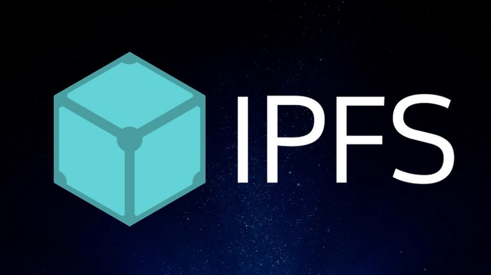
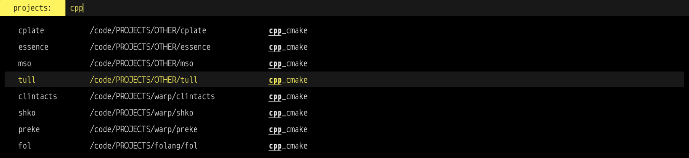

Same source, two renderers
==========================

This deck uses Presenterm's Markdown contract directly.

<!-- pause -->

FAQE keeps the terminal-friendly source and adds the chromatic browser layer.

<!-- speaker_note: The pause above becomes a fragment in the browser and a pause in Presenterm. -->

<!-- end_slide -->

Accent-driven surfaces
======================

<!-- incremental_lists: true -->

* Headings, borders, controls, and progress inherit the accent.
* The second palette color drives the chromatic split.
* Foreground and background come from the Presenterm theme override.

<!-- end_slide -->

Images are ordinary Markdown
============================



Presenterm displays this through the terminal graphics protocol; FAQE fingerprints and frames the same local asset.

<!-- end_slide -->

Columns use Presenterm commands
==============================

<!-- column_layout: [2, 1] -->

<!-- column: 0 -->

```rust
fn palette(accent: Color, surface: Color) -> Theme {
    Theme {
        text: surface.best_contrast(),
        accent: accent.make_accessible_on(surface),
    }
}
```

* Same Markdown
* Same source paths
* Different native renderer

<!-- column: 1 -->



<!-- reset_layout -->

The layout returns to the full slide after `reset_layout`.

<!-- end_slide -->

Tables and structured content
=============================

| Surface | Text | Accent |
| --- | --- | --- |
| Dark | Light | Contrast adjusted |
| Light | Dark | Contrast adjusted |
| Media | Inherited | Palette driven |

> A presentation theme should follow the content palette without making the author fight every slide.

<!-- end_slide -->

<!-- jump_to_middle -->
<!-- alignment: center -->
<!-- no_footer -->

One file everywhere
===================

Run it in the terminal with `make present` or open the generated talk route in the browser.
